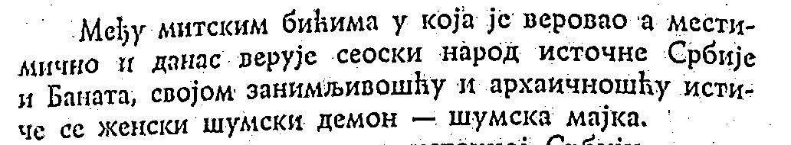

# pdf-vision

I'm starting this project because I have a book I want textified that's in PDF format, but it appears to just be scanned pages.

# Structure

You can have a `scratch/` folder to stash your items, and the gitignore will handle that.

# Dependencies

We require:

- PyPDF2 for reading PDFs.
- Pillow for handling images.
- Tesseract for OCR.
- OpenCV for image pre-processing.

For my application, I installed the Serbian language pack.

```
apt install tesseract-ocr-srp
```

# Getting Started

We recommend a virtual environment.

```
$ python3 -m venv venv
$ source venv/bin/activate
$ python3 -m pip install -r requirements.txt
```

# Sample Input

The book I used to test this program is a Serbian historical text, and can be downloaded from Google Drive:
https://drive.google.com/file/d/1ViI2Hq5ohhPO1pM-u_i2Lv3MAUrYS-l4/view?usp=sharing

# Sample Output

Input Image:



Text Output:

Међу митским бићима у која је веровао 'а мести-
мично и данас верује сеоски народ источне Србије
и Баната, својом занимљивошћу и архаичношћу истИ-
че се женски шумски демон — шумска мајка.